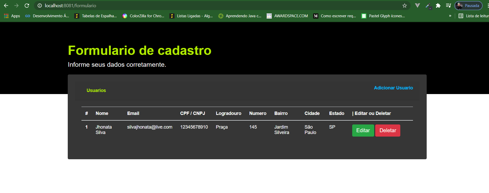

# nodejs-formulario

  

## Description
Aplicação desenvolvida com Node js e Mysql com objetivo de cadastrar novos usuários com os dados que vem do formulario e são armazenados no banco de dados mysql.
Foi implementado o CRUD para que a aplicação possa adicionar, editar e deletar os usuarios.
